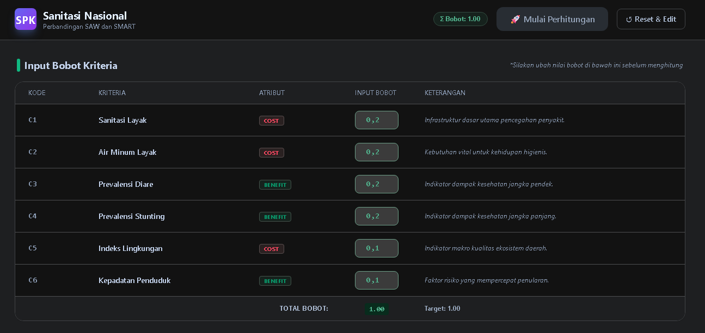
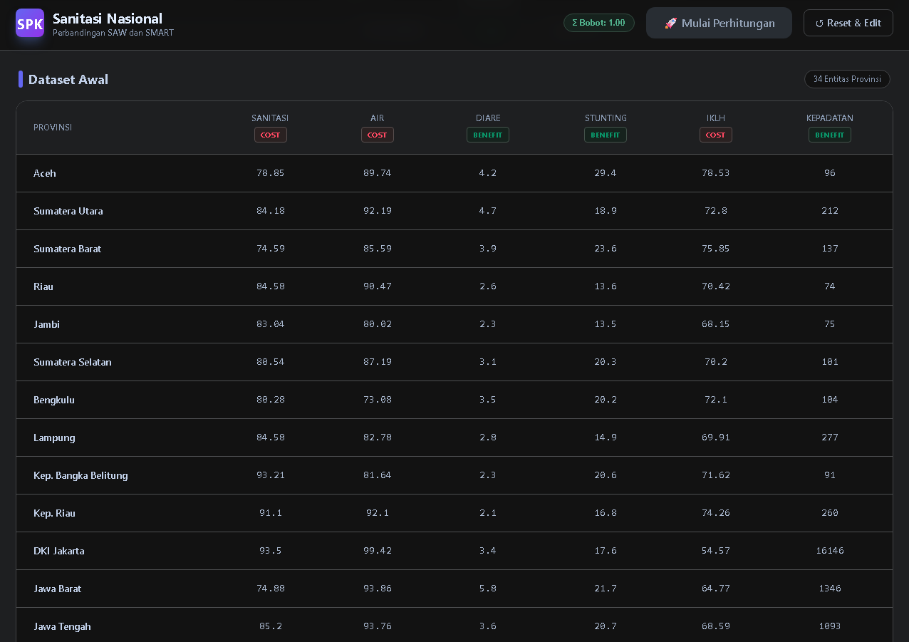

# 🏆 SPK-Sanitasi — Sistem Pendukung Keputusan Prioritas Bantuan Sanitasi

**Perbandingan Metode SAW vs SMART untuk Penentuan Prioritas Bantuan Sanitasi di 34 Provinsi Indonesia**


> Aplikasi web interaktif berbasis **Sistem Pendukung Keputusan (SPK)** yang membandingkan dua metode Multi-Criteria Decision Making (MCDM) — **SAW (Simple Additive Weighting)** dan **SMART (Simple Multi-Attribute Rating Technique)** — untuk menentukan provinsi mana yang paling prioritas menerima bantuan sanitasi bersih.

---

## 🎯 Latar Belakang

Akses sanitasi layak di Indonesia masih tidak merata antar-provinsi. Pemerintah perlu memutuskan **provinsi mana yang paling membutuhkan bantuan** dengan mempertimbangkan banyak faktor sekaligus (kriteria majemuk).

Masalahnya: pengambilan keputusan manual dengan banyak kriteria itu **subjektif dan tidak konsisten**. SPK ini menyelesaikan masalah tersebut dengan:

1. **Kuantifikasi bobot** — setiap kriteria diberi bobot kepentingan (total harus 100%).
2. **Metode matematis teruji** — SAW dan SMART menghitung skor objektif untuk semua provinsi.
3. **Perbandingan metode** — dua metode dihitung paralel sehingga hasil bisa divalidasi silang.
4. **Transparansi penuh** — setiap angka bisa ditelusuri langkah per langkah (*traceability*).

---

## ⚙️ Fitur Utama

| Fitur | Deskripsi |
|:---|:---|
| 🎚️ **Input Bobot Interaktif** | Ubah bobot 6 kriteria langsung dari UI; validasi otomatis total harus = 1.00 |
| 🧮 **Dua Metode Sekaligus** | SAW & SMART dihitung paralel untuk 34 provinsi dalam satu klik |
| 🏆 **Perangkingan Ganda** | Toggle ranking berdasarkan skor SAW atau SMART |
| 📊 **Visualisasi Grafik** | Bar chart perbandingan skor SAW vs SMART (Recharts) |
| 🔍 **Traceability Lengkap** | Setiap provinsi menampilkan rincian normalisasi (SAW) / utilisasi (SMART) + pembuktian Σ bobot |
| 🧠 **Validasi Bobot** | Tombol perhitungan terkunci jika total bobot ≠ 1.00 (cegah hasil salah) |
| 🗄️ **Dataset 34 Provinsi** | Data indikator kesehatan & sanitasi seluruh provinsi Indonesia |

---

## 🧮 Metode yang Digunakan

### Metode SAW (Simple Additive Weighting)

Normalisasi matriks keputusan, lalu skor akhir = jumlah bobot × nilai ternormalisasi:

```
Benefit:  R = x / max(x)        (semakin besar, semakin baik)
Cost:     R = min(x) / x        (semakin kecil, semakin baik)
Skor      = Σ (W × R)
```

### Metode SMART (Simple Multi-Attribute Rating Technique)

Menggunakan *range* (selisih max-min) sebagai basis utilisasi:

```
Benefit:  U = (x − min) / (max − min)
Cost:     U = (max − x) / (max − min)
Skor      = Σ (W × U)
```

> **Kenapa dua metode?** SAW sensitif terhadap outlier, SMART lebih robust terhadap rentang nilai. Membandingkan keduanya memberi **validasi silang** — jika ranking SAW dan SMART konsisten, hasil keputusan lebih dapat dipercaya.

---

## 📋 Kriteria Penilaian

| Kode | Kriteria | Atribut | Bobot | Interpretasi |
|:---:|:---|:---:|:---:|:---|
| C1 | Sanitasi Layak | Cost | 20% | Semakin **rendah** aksesnya → semakin prioritas dibantu |
| C2 | Air Minum Layak | Cost | 20% | Semakin **rendah** aksesnya → semakin prioritas dibantu |
| C3 | Prevalensi Diare | Benefit | 20% | Semakin **tinggi** kasusnya → semakin prioritas |
| C4 | Prevalensi Stunting | Benefit | 20% | Semakin **tinggi** kasusnya → semakin prioritas |
| C5 | Indeks Lingkungan | Cost | 10% | Semakin **buruk** lingkungannya → semakin prioritas |
| C6 | Kepadatan Penduduk | Benefit | 10% | Semakin **padat** → semakin cepat penularan → prioritas |

**Interpretasi atribut dalam konteks prioritas bantuan:**
- **Benefit** = semakin besar nilainya, semakin **layak menerima bantuan** (misal: kasus stunting tinggi = darurat).
- **Cost** = semakin kecil nilainya, semakin **layak menerima bantuan** (misal: akses sanitasi rendah = butuh bantuan).

---

## 📊 Dataset

- **34 entitas** — seluruh provinsi Indonesia (Aceh s/d Papua).
- **6 indikator per provinsi** — sanitasi layak, air minum layak, prevalensi diare, prevalensi stunting, indeks lingkungan, kepadatan penduduk.
- Data bersifat **sekunder** dari sumber statistik publik Indonesia, di-embed langsung di aplikasi (client-side, tanpa backend).

---

## 🛠️ Tech Stack

| Layer | Teknologi |
|:---|:---|
| Framework | **React 19** (Create React App) |
| Styling | **Tailwind CSS 3.4** |
| Chart | **Recharts 3.6** |
| Bahasa | JavaScript (JSX) |
| Build | react-scripts 5 (CRA) |

---

## 🚀 Cara Menjalankan

```bash
# 1. Install dependencies
npm install

# 2. Jalankan di development (localhost:3000)
npm start

# 3. Build untuk production
npm run build

# 4. Menjalankan test
npm test
```

---

## 📁 Struktur Project

```
SPK-Sanitasi/
├── public/                 # Static assets (index.html, favicon)
├── src/
│   ├── App.jsx             # Komponen utama (632 baris) — seluruh logika SPK
│   ├── App.js              # Entry point React
│   ├── index.js            # Root render
│   └── index.css           # Tailwind directives
├── package.json            # Dependencies & scripts
├── tailwind.config.js      # Konfigurasi Tailwind
└── postcss.config.js       # Konfigurasi PostCSS
```

**Alur logika di `App.jsx`:**

```
User input bobot → validasi (Σ = 1.00?)
  → handleCalculate()
    → Hitung max/min global per kriteria
    → Normalisasi SAW (benefit/cost)
    → Utilisasi SMART (benefit/cost)
    → Skor akhir = Σ (bobot × nilai)
    → Sortir ranking → render tabel + grafik + log detail
```

---

## 🖥️ Tampilan Aplikasi (UI States)

Aplikasi memiliki **3 state utama** yang berubah berdasarkan interaksi user:

---

### **State 1: Setup & Input Bobot** (Sebelum Perhitungan)

**Header (Sticky Top Bar):**
- **Logo SPK** — kotak ungu gradien indigo→purple dengan teks "SPK"
- **Judul Aplikasi** — "Sanitasi Nasional" + subtitle "Perbandingan SAW dan SMART"
- **Indikator Total Bobot** — pill hijau/merah menampilkan `Σ Bobot: X.XX`
  - 🟢 **Hijau** (`1.00`) = valid, tombol perhitungan aktif
  - 🔴 **Merah** (≠ `1.00`) = tidak valid, tombol terkunci + ikon ⚠️
- **Tombol "🚀 Mulai Perhitungan"** — enabled hanya jika bobot valid & belum dihitung
- **Tombol "↻ Reset & Edit"** — muncul setelah perhitungan, untuk kembali ke mode edit

**Section 1: Input Bobot Kriteria** (Card putih dengan shadow subtle)
| Kolom | Isi |
|:---|:---|
| **Kode** | C1–C6 (font mono, abu-abu) |
| **Kriteria** | Nama lengkap (Sanitasi Layak, Air Minum Layak, dll) |
| **Atribut** | Badge **Cost** (merah muda/rose) atau **Benefit** (hijau/emerald) |
| **Input Bobot** | Input numerik `0.00–1.00`, step `0.01` |
| **Keterangan** | Alasan ilmiah bobot (italik, abu-abu) |

*Baris terakhir: **Total Bobot** — otomatis menjumlahkan, berwarna hijau jika 1.00, merah berkedip jika tidak.*

**Section 2: Dataset Awal** (Read-only)
- Badge "34 Entitas Provinsi" di kanan header section
- Tabel 34 baris × 7 kolom: **Provinsi | Sanitasi | Air | Diare | Stunting | IKLH | Kepadatan**
- Setiap header kolom kriteria menampilkan badge **Cost/Benefit** (warna sama seperti section input)
- Data bersumber dari statistik publik Indonesia (embed di kode, client-side)

---

### **State 2: Hasil Perhitungan** (Setelah Klik "🚀 Mulai Perhitungan")

Muncul **2 section baru** di bawah dataset (animasi fade-in-up):

#### **Section 3: Perangkingan & Visualisasi Grafik** (Grid 1:2 di desktop)

**Kiri (col-span-1): Tabel Perangkingan**
- Header: "🏆 Hasil Perangkingan" + penjelasan "Menggunakan bobot yang Anda input"
- **Toggle Tab**: "SAW Rank" (indigo) | "SMART Rank" (fuchsia) — klik untuk mengurutkan ulang
- Tabel: **# | Provinsi | SAW Score | SMART Score**
  - Baris #1 highlight kuning emas 👑 (provinsi prioritas tertinggi)
  - Kolom metode aktif berwarna (indigo/fuchsia), kolom non-aktif abu-abu
  - Font mono untuk skor (presisi 4 desimal)

**Kanan (col-span-2): Bar Chart Perbandingan** (Recharts)
- **X-Axis**: 34 provinsi (label miring -45°, tinggi 80px)
- **Y-Axis**: Skor 0–1
- **Dua seri bar berdampingan per provinsi**:
  - 🔵 **SAW** — indigo (`#6366f1`), opacity penuh saat tab SAW aktif, 30% saat SMART
  - 🟣 **SMART** — fuchsia (`#d946ef`), opacity penuh saat tab SMART aktif, 30% saat SAW
- Animasi masuk 1 detik, radius atas 4px
- **Custom Tooltip** (hover): card putih shadow-xl menampilkan nilai SAW & SMART provinsi tersebut

#### **Section 4: Rincian Langkah Perhitungan (Traceability)** — *Fitur Kunci*

Grid 2 kolom (XL): **Kiri = Detail SAW** | **Kanan = Detail SMART**

**Per Method Card (per Provinsi):**
```
┌─────────────────────────────────────────────┐
│ [Indigo/Fuchsia Header]  Provinsi    [Skor] │
├─────────────────────────────────────────────┤
│ Kriteria | Norm/Util Formula = Hasil         │
│  C1      | Min/Val = 0.1234  W: 0.1234×0.20  │
│  C2      | Val/Max = 0.5678  W: 0.5678×0.20  │
│   ...    |   ...                              │
├─────────────────────────────────────────────┤
│ Pembuktian (Σ Bobot):                       │
│ 0.0247 + 0.1136 + ... = 0.2345 ← Skor Akhir │
└─────────────────────────────────────────────┘
```

**SAW (Kiri — Tema Indigo):**
- Rumus normalisasi: `Benefit: Nilai/Max` | `Cost: Min/Nilai`
- Setiap baris: `Norm Formula = Hasil` → `Weighted Formula = Hasil`

**SMART (Kanan — Tema Fuchsia):**
- Rumus utilisasi: `Benefit: (Nilai-Min)/(Max-Min)` | `Cost: (Max-Nilai)/(Max-Min)`
- Setiap baris: `Util Formula = Hasil` → `Weighted Formula = Hasil`

**Fitur Pembuktian Σ Bobot** — setiap provinsi menampilkan penjumlahan transparan semua kontribusi bobot yang hasilnya **persis sama dengan skor akhir** yang ditampilkan di tabel ranking. Ini memastikan **auditability** penuh.

---

### **State 3: Reset & Edit** (Klik "↻ Reset & Edit")

- Sembunyikan Section 3 & 4
- Kembalikan Section 1 (Input Bobot) ke mode editable
- Reset `showResult = false`, `finalRanking = []`, `calculationSteps = null`
- User bisa ubah bobot & hitung ulang

---

### **Ringkasan Alur User**

```
[Buka App] → [Lihat Dataset] → [Atur Bobot 6 Kriteria]
    ↓ (Validasi Σ=1.00)
[Klik 🚀 Mulai Perhitungan]
    ↓
[Lihat Ranking SAW vs SMART] + [Bandingkan Grafik Bar]
    ↓
[Buka Detail Traceability per Provinsi] ← Validasi manual rumus
    ↓
[Klik ↻ Reset & Edit] → [Ulangi dengan Bobot Berbeda]
```

---

### **Screenshot dan Keterangan Gambar**

Simpan semua gambar di folder berikut:

```text
SPK-Sanitasi/
└── docs/
    └── screenshots/
        ├── 01-input-bobot.png
        ├── 02-dataset-awal.png
        ├── 03-hasil-perangkingan-dan-visualisasi-grafik.png
        ├── 04-rincian-saw-dan-smart.png
```

#### 1. Input Bobot Kriteria

Letakkan screenshot bagian input bobot sebagai:

```text
docs/screenshots/01-input-bobot.png
```

```md

```


Gambar ini menampilkan form utama untuk mengatur bobot enam kriteria penilaian. Setiap kriteria memiliki kode, nama kriteria, atribut Cost/Benefit, input bobot, dan keterangan. Total bobot harus bernilai `1.00` agar perhitungan SAW dan SMART dapat dijalankan.

#### 2. Dataset Awal

Letakkan screenshot bagian dataset awal sebagai:

```text
docs/screenshots/02-dataset-awal.png
```

```md

```


Gambar ini menampilkan dataset 34 provinsi Indonesia yang digunakan sebagai data awal perhitungan. Kolom dataset terdiri dari Provinsi, Sanitasi, Air Minum, Diare, Stunting, IKLH, dan Kepadatan Penduduk. Data ini menjadi dasar untuk proses normalisasi SAW dan utilisasi SMART.

#### 3. Hasil Perangkingan dan Visualisasi Grafik

Letakkan screenshot tabel hasil ranking sebagai:

```text
docs/screenshots/03-hasil-perangkingan-dan-visualisasi-grafik.png
```

```md

```


Gambar ini menampilkan hasil akhir perhitungan dalam bentuk tabel ranking. Setiap provinsi memiliki skor SAW dan skor SMART. User dapat membandingkan perbedaan urutan prioritas berdasarkan dua metode tersebut dan menampilkan perbandingan skor SAW dan SMART dalam bentuk bar chart. Grafik membantu melihat perbedaan skor antar-provinsi secara visual sehingga hasil ranking lebih mudah dianalisis.

#### 4. Rincian Langkah Perhitungan SAW dan SMART

Letakkan screenshot rincian SAW sebagai:

```text
docs/screenshots/05-rincian-saw-dan-smart.png
```

```md

```


Gambar ini menampilkan proses perhitungan metode SAW secara detail. Untuk kriteria Benefit digunakan rumus `Nilai / Max`, sedangkan untuk kriteria Cost digunakan rumus `Min / Nilai`. Setiap hasil normalisasi dikalikan dengan bobot, lalu dijumlahkan menjadi skor akhir.
dan menampilkan proses perhitungan metode SMART secara detail. Untuk kriteria Benefit digunakan rumus `(Nilai - Min) / (Max - Min)`, sedangkan untuk kriteria Cost digunakan rumus `(Max - Nilai) / (Max - Min)`. Hasil utilitas setiap kriteria dikalikan dengan bobot, lalu dijumlahkan menjadi skor akhir.

---

## 👥 Anggota Tim (Kelompok 9)

| NIM | Nama |
|:---|:---|
| 4523210003 | Aditya Nur Lintang |
| 4523210044 | Fahran Maulana Febryan |
| 4523210055 | Jovan Alfito Praditia |

---

## 🗺️ Roadmap Pengembangan

- [ ] Integrasi backend (database) agar dataset bisa diperbarui dinamis
- [ ] Tambah metode MCDM lain (TOPSIS, AHP, WP) untuk perbandingan lebih luas
- [ ] Filter & pencarian provinsi
- [ ] Ekspor hasil ke CSV/PDF
- [ ] Deploy ke hosting cloud (S3/Netlify/Vercel)

---

## 📝 Lisensi

Project ini dibuat untuk tujuan akademik. Bebas digunakan untuk pembelajaran dan pengembangan lebih lanjut.
